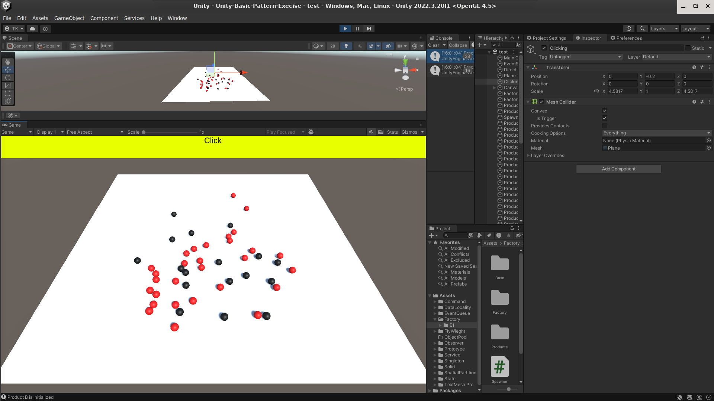

## Factory


The Factory Design Pattern is a creational design pattern that provides an interface for creating objects, but lets subclasses decide which class to instantiate. Here's a breakdown of the Factory pattern in C#:

## Components:
* Product Interface: Defines the interface of objects the factory creates. Concrete product classes will implement this interface.
* Concrete Product Classes: Implement the Product interface and represent specific types of objects the factory can create.
* Creator Class (Optional): Declares the factory method, which returns an object of type Product. May also define a default implementation.
* Concrete Creator Classes: Subclasses of Creator that override the factory method to return a specific ConcreteProduct class.
### Benefits:
Decouples object creation from client code.
Promotes code flexibility by allowing easy addition of new product types.
Makes code more maintainable by centralizing object creation logic.


Click and randomly selected factory will spawn object




```csharp

public interface IShape
{
    void Draw();
}

public class Square : IShape
{
    public void Draw()
    {
        // Implement logic to draw a square (e.g., using Unity's graphics API)
    }
}

public class Circle : IShape
{
    public void Draw()
    {
        // Implement logic to draw a circle (e.g., using Unity's graphics API)
    }
}

public class ShapeFactory
{
    public IShape GetShape(string shapeType)
    {
        if (shapeType.ToLower() == "square")
        {
            return new Square();
        }
        else if (shapeType.ToLower() == "circle")
        {
            return new Circle();
        }
        else
        {
            throw new ArgumentException("Invalid shape type provided.");
        }
    }
}

public class ShapeManager : MonoBehaviour
{
    private ShapeFactory factory;

    void Start()
    {
        factory = new ShapeFactory();
    }

    public void DrawSquare()
    {
        IShape square = factory.GetShape("square");
        square.Draw();
    }

    public void DrawCircle()
    {
        IShape circle = factory.GetShape("circle");
        circle.Draw();
    }
}


```