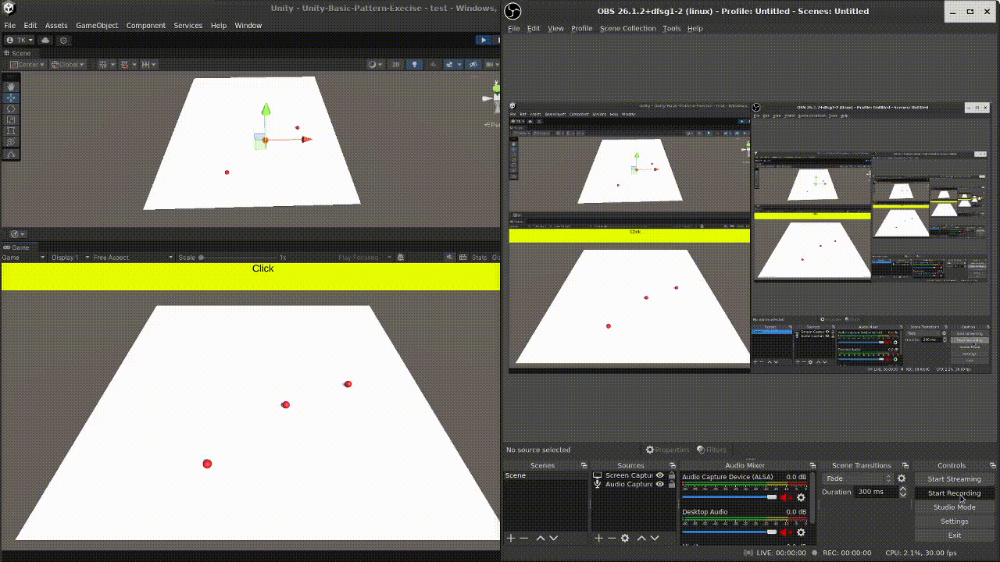

# Object Pool

### Benefits:
* Improves performance by reusing objects instead of constantly creating and destroying them.
* Reduces memory usage by keeping a limited pool of objects.

```csharp

public class ObjectPooler : MonoBehaviour
{
    [SerializeField] private GameObject prefab;
    private ObjectPool<GameObject> pool;

    void Start()
    {
        pool = Pool.Create(prefab); // Create pool for the prefab
    }

    public GameObject GetObject()
    {
        GameObject obj = pool.Get(); // Get an object from the pool
        obj.transform.position = Vector3.zero; // Set initial position (optional)
        obj.SetActive(true); // Activate the object
        return obj;
    }

    public void ReturnObject(GameObject obj)
    {
        obj.SetActive(false); // Deactivate the object
        pool.Release(obj); // Return the object to the pool
    }
}

```

